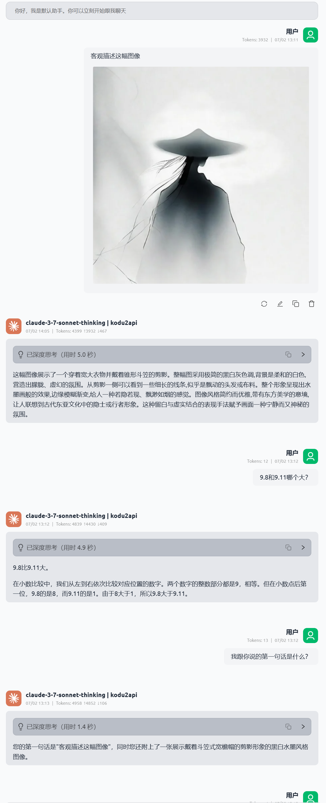

# Kodu AI OpenAI API 适配器

<div align="center">


</div>

> 高性能异步 AI 代理服务，将 Kodu AI 的 Claude 3.7 Sonnet 模型转换为 OpenAI API 格式，支持真正的流式响应和高并发处理。

## ✨ 核心特性

- **⚡ 高并发异步架构**：基于 httpx + FastAPI，支持数千并发连接
- **🔧 OpenAI 完全兼容**：零修改集成现有 OpenAI 客户端和工具
- **🧠 思维链支持**：支持 Claude 3.7 Sonnet Thinking 模型的推理过程
- **🖼️ 多模态图像支持**：支持图像信息
- **📦 开箱即用**：Docker 一键部署，配置简单





## ⚡ 快速开始

### 1. 克隆项目
```bash
git clone <repository-url>
cd kodu2api
```

### 2. 配置密钥

#### 配置 Kodu API 密钥
在你注册完成后，在同一浏览器下中访问
```
https://www.kodu.ai/auth/login?redirectTo=vscode://kodu-ai.claude-dev-experimental&ext=1
```
图示中的`code`即为你的`kodu-api-key`


创建 `kodu.json`：
```json
[
  "sk-your-kodu-api-key-1",
  "sk-your-kodu-api-key-2"
]
```

#### 配置客户端密钥
创建 `client_api_keys.json`：
```json
[
  "sk-client-key-1",
  "sk-client-key-2"
]
```

#### 配置可用模型
创建 `models.json`：
```json
[
  "claude-3-7-sonnet-thinking",
  "claude-3-7-sonnet"
]
```

### 3. 启动服务

#### 方式一：Docker 部署（推荐）
```bash
docker-compose up -d
```

#### 方式二：本地运行
```bash
pip install -r requirements.txt
python main.py
```

### 4. 验证服务
```bash
curl -H "Authorization: Bearer sk-client-key-1" http://localhost:8000/v1/models
```

## 📋 支持的模型

| 模型名称 | 类型 | 特性 |
|---------|------|------|
| `claude-3-7-sonnet-thinking` | 推理模型 | 支持思维链，显示推理过程 |
| `claude-3-7-sonnet` | 对话模型 | 快速响应，适合常规对话 |

## 🔌 API 接口

### 聊天完成
```http
POST /v1/chat/completions
Authorization: Bearer <client-api-key>
Content-Type: application/json
```

**请求示例：**
```json
{
  "model": "claude-3-7-sonnet",
  "messages": [
    {"role": "user", "content": "你好"}
  ],
  "stream": true,
  "temperature": 0.7,
  "max_tokens": 4000
}
```

### 模型列表
```http
GET /v1/models
Authorization: Bearer <client-api-key>
```

## 💻 使用示例

### Python + OpenAI SDK
```python
import openai

client = openai.OpenAI(
    api_key="sk-client-key-1",
    base_url="http://localhost:8000/v1"
)

# 流式对话
response = client.chat.completions.create(
    model="claude-3-7-sonnet",
    messages=[{"role": "user", "content": "写一首关于春天的诗"}],
    stream=True
)

for chunk in response:
    if chunk.choices[0].delta.content:
        print(chunk.choices[0].delta.content, end="")
```

### cURL
```bash
curl -X POST http://localhost:8000/v1/chat/completions \
  -H "Authorization: Bearer sk-client-key-1" \
  -H "Content-Type: application/json" \
  -d '{
    "model": "claude-3-7-sonnet",
    "messages": [{"role": "user", "content": "你好"}],
    "stream": true
  }'
```

## 📁 项目结构

```
kodu2api/
├── main.py              # 主程序（异步服务器 + API 适配器）
├── requirements.txt     # Python 依赖
├── Dockerfile          # Docker 构建文件
├── docker-compose.yml  # Docker Compose 配置
├── kodu.json           # Kodu API 密钥配置
├── client_api_keys.json # 客户端 API 密钥配置
└── models.json         # 可用模型配置
```

## 🔧 高级配置

### 环境变量
```bash
# Docker Compose 环境变量
KODU_HOST=0.0.0.0        # 服务监听地址
KODU_PORT=8000           # 服务监听端口
KODU_WORKERS=1           # Worker 进程数
```

### 连接池配置
```python
# 在 main.py 中可调整
httpx.AsyncClient(
    timeout=httpx.Timeout(120.0),
    limits=httpx.Limits(
        max_connections=100,      # 最大连接数
        max_keepalive_connections=20  # 保持连接数
    )
)
```

---

<div align="center">

**如果这个项目对您有帮助，请考虑给个 ⭐ Star！**

</div> 